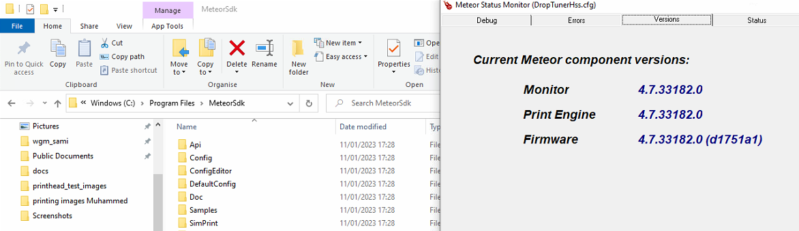

# cooling system submodule
this repo holds the cooling system source code. to be added later to the core wgm software.
* Note: dll version need to match the sdk version installed. see meteor engine 
# src

# includes

# dependencies

# docs

# build

# test

# cmake
